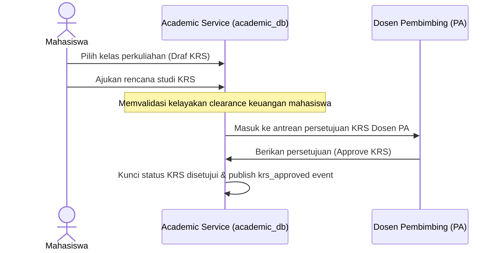

# Alur Proses Bisnis & Spesifikasi Fungsional - Akademik Module

## 1. Visi & Tujuan Modul
Modul Akademik (SIAKAD) bertindak sebagai jantung operasional perkuliahan mahasiswa, kurikulum prodi, persetujuan KRS oleh dosen pembimbing akademik, serta pelaporan kelulusan nilai mahasiswa (KHS/Transkrip).

## 2. Tabel Spesifikasi Fungsional (FSD)

| Layar / Fungsi | Peran (Role) | Field Utama | Aksi Pengguna | Validasi / Aturan Bisnis | Output / Integrasi |
| --- | --- | --- | --- | --- | --- |
| **Kalender Akademik** | Admin Akademik Biro | Tahun Ajaran, Periode, Batas KRS, Batas Kelas | Create, Activate, Close | Tanggal batas KRS harus di bawah periode akademik aktif | Konfigurasi waktu operasional |
| **Kelola Kurikulum** | Admin Prodi / Biro | Kode Kurikulum, Nama, Tahun Kurikulum, Status | Create, Activate, Archive | Tahun Kurikulum berbeda dengan Tahun Ajaran operasional | Versi kurikulum aktif prodi |
| **Katalog Mata Kuliah** | Admin Prodi | Kode MK, Nama MK, SKS, Semester, Prasyarat | Create, Update, Deactivate | Kode MK unik, SKS bernilai positif | Struktur mata kuliah kurikulum |
| **Penawaran Kelas** | Admin Akademik | MK Pilihan, Periode, Kode Kelas, Kuota, Dosen | Create, Update, Publish | Periode akademik aktif, dosen terdaftar di HRIS | Kelas perkuliahan SIAKAD |
| **Generate NIM** | Admin Akademik Biro | Data Handover PMB, Prodi, Kurikulum | Generate NIM | Hanya untuk pendaftar lolos seleksi & daftar ulang | NIM terbit, profil mahasiswa aktif |
| **KRS Paket** | Admin Akademik, Mhs | Mahasiswa ID, Paket Kelas, Periode | Generate, Approve | Hanya untuk mahasiswa semester 1 & 2 | KRS paket disetujui |
| **KRS Mandiri** | Mahasiswa | MK Penawaran, Pilihan Kelas, Kuota SKS | Select, Drop, Submit KRS | Syarat minimum IPK, kuota kelas, prasyarat MK, status clearance | KRS berstatus diajukan |
| **Persetujuan KRS PA** | Dosen Wali (PA) | KRS ID Mahasiswa, Catatan Dosen PA | Approve KRS, Reject | Dosen PA harus sesuai pembimbing wali | KRS berstatus disetujui (Approved) |
| **Plot Nilai Akhir** | Admin Akademik, Dosen | Komponen Nilai (Tugas/UAS), Nilai Akhir | Review, Finalize Grade | Nilai angka valid (0-100), bobot persentase total 100% | Nilai final terkunci |
| **Koreksi Nilai** | Admin authorized | Mahasiswa ID, Kelas, Nilai Lama, Nilai Baru, Alasan | Submit Correction | Alasan koreksi wajib diisi | Riwayat koreksi nilai |
| **KHS & Transkrip** | Mahasiswa, Admin | Periode, IPS, IPK, Riwayat Nilai | View, Publish, Download | Sesuai aturan clearance layanan akademik | Cetak KHS & Transkrip |

---

## 3. Diagram Alur Proses Bisnis

### A. Alur Pengisian & Approval KRS Mahasiswa

### B. Alur Penerbitan Nilai Akhir Perkuliahan (Grade Publication)
1. **Penerimaan Nilai Mentah**: Sistem menerima input nilai mentah tugas/kuis dari LMS atau ujian CBT Assessment.
2. **Kompilasi Dosen**: Dosen pengampu membuka kelas perkuliahan di SIAKAD, melakukan plot nilai UTS/UAS, dan mengklik tombol *Finalisasi Nilai*.
3. **Penerbitan KHS**: Nilai dikunci, Indeks Prestasi Semester (IPS) dan Indeks Prestasi Kumulatif (IPK) dihitung secara otomatis, dan Kartu Hasil Studi (KHS) diterbitkan untuk diakses mahasiswa.

---

## 4. Keandalan Lintas Modul (Failure Isolation & Recovery)
* **Clearance Snapshot Rule**: Saat melakukan pengisian KRS, SIAKAD tidak melakukan query SQL langsung ke database Finance, melainkan membaca data `student_clearance_snapshots` lokal terakhir. Jika data snapshot tidak ditemukan, transaksi KRS dialihkan menjadi status `PENDING_REVIEW` untuk mencegah crash sistem.
* **Idempotent Student Creation**: Pembuatan mahasiswa baru dari data handover PMB divalidasi berdasarkan ID unik pendaftar untuk mencegah duplikasi pembuatan NIM jika event dikirim ulang oleh antrean broker.
