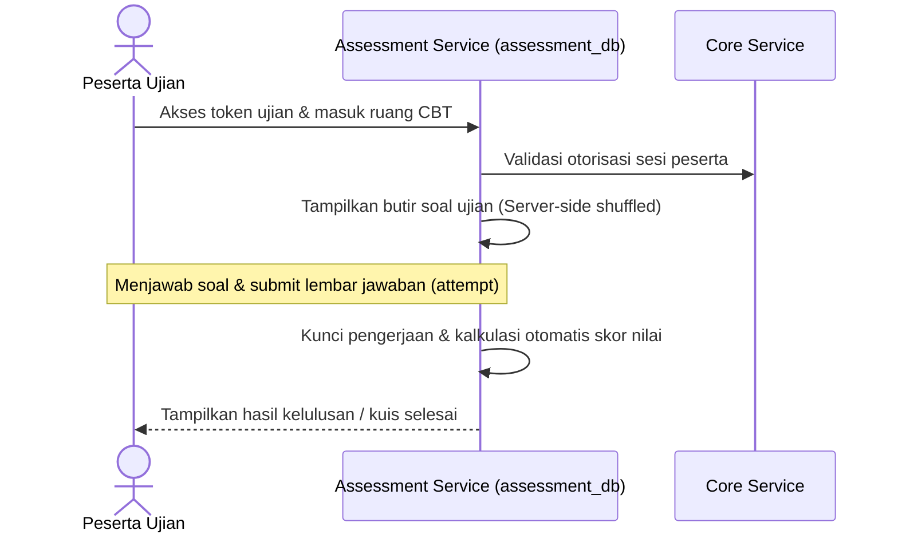

# Alur Proses Bisnis & Spesifikasi Fungsional - Assessment Module

## 1. Visi & Tujuan Modul
Modul Assessment bertanggung jawab menyediakan engine ujian berbasis komputer (CBT), bank soal ujian (*question bank*), pencatatan versi soal, penjadwalan sesi ujian CBT (UTS/UAS/Ujian Masuk PMB), penyimpanan lembar jawaban peserta, kalkulasi otomatis skor ujian, dan penerbitan hasil ujian kelulusan.

## 2. Tabel Spesifikasi Fungsional (FSD)

| Layar / Fungsi | Peran (Role) | Field Utama | Aksi Pengguna | Validasi / Aturan Bisnis | Output / Integrasi |
| --- | --- | --- | --- | --- | --- |
| **Bank Soal** | Admin Assessment, Dosen | Butir Soal, Tipe Soal, Pilihan Jawaban, Kunci | Create, Update Draft | Field wajib terisi, kunci jawaban teridentifikasi | Bank soal tersimpan |
| **Versi Soal** | Admin Assessment | Soal ID, Versi, Status | Create New Version | Soal yang sedang aktif diujikan dilarang diedit langsung | Histori revisi soal |
| **Paket Soal** | Admin Assessment | Nama Paket, Acak Soal, Bobot Nilai | Create, Publish | Harus mereferensikan butir soal berstatus aktif | Paket soal siap diujikan |
| **Sesi Assessment** | Admin Assessment, PMB | Konteks Modul, Jadwal, Durasi, Batas Lulus | Create, Open, Close | Rentang waktu valid, durasi bernilai positif | Sesi ujian CBT dibuka |
| **Kelola Peserta** | Admin Assessment | Peserta ID, Tipe Peserta, Kelayakan | Assign, Remove | Peserta harus valid terdaftar di modul asal | Daftar peserta ujian CBT |
| **Attempt Engine** | Peserta | Jawaban Soal, Penanda Waktu | Start, Answer, Submit Ujian | Ujian dalam rentang aktif, durasi belum habis | Lembar attempt tersimpan |
| **Scoring** | System, Admin | Kunci Jawaban, Nilai Ujian | Auto Score, Manual Review | Rumus pembobotan nilai valid | Nilai final assessment |
| **Kuesioner/Survey** | Admin, Peserta | Butir Kuesioner, Pilihan Jawaban | Submit Survey | Konteks survei valid | Hasil survei |
| **Result API** | System | Penerima Hasil, Nilai, Status Lulus | Send Result | Peta pemetaan consumer valid | Hasil disalurkan ke modul asal |

---

## 3. Diagram Alur Proses Bisnis

### A. Alur Pelaksanaan Ujian CBT

### B. Alur Pengiriman Hasil Ujian Kelulusan
1. **Pengerjaan Selesai**: Peserta menyelesaikan ujian CBT dan menekan tombol submit (atau waktu pengerjaan habis).
2. **Kalkulasi Skor**: Engine Assessment secara otomatis menghitung nilai berdasarkan bobot soal dan kunci jawaban.
3. **Penyaluran Hasil**: Hasil ujian dipublikasikan via event `assessment.result_calculated` secara idempotent. Modul PMB (untuk seleksi camaba) atau SIAKAD/LMS (untuk nilai kuis semester) menangkap event tersebut untuk memperbarui status lokal.

---

## 4. Keandalan Lintas Modul (Failure Isolation & Recovery)
* **Server-Side Answer Preservation**: Jawaban peserta ujian CBT disimpan secara berkala per butir nomor soal yang dijawab. Hal ini menjamin pengerjaan ujian peserta tidak hilang jika browser mengalami crash atau jaringan internet terputus di tengah jalan.
* **Idempotency Attempt Guard**: Penguncian sesi attempt peserta dilakukan secara server-side menggunakan `idempotency_key` khusus guna mencegah pengerjaan ulang ganda (*double attempt submit*) akibat pengiriman data berulang-ulang.
