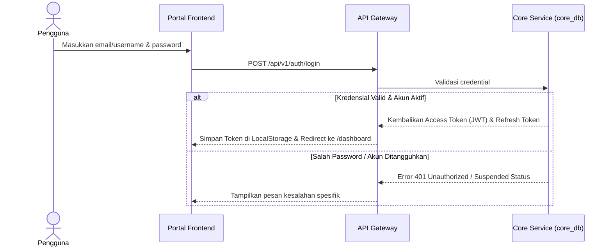

# Alur Proses Bisnis & Spesifikasi Fungsional - Core Module

## 1. Visi & Tujuan Modul
Modul Core bertindak sebagai otoritas utama otentikasi identitas (*single identity*) dan Single Sign-On (SSO) di seluruh ekosistem UNSIA ERP. Modul ini memastikan seluruh pengguna memiliki kredensial terpusat dan perizinan berbasis peran (RBAC) yang konsisten.

## 2. Tabel Spesifikasi Fungsional (FSD)

| Layar / Fungsi | Peran (Role) | Field Utama | Aksi Pengguna | Validasi / Aturan Bisnis | Output / Integrasi |
| --- | --- | --- | --- | --- | --- |
| **Login SSO** | Semua Pengguna | Username/Email, Password, Captcha (opsional) | Submit Login, Lupa Password | Kredensial valid, Akun berstatus aktif, Batas percobaan login salah | Sesi aktif, token JWT, audit log login |
| **Pilih Peran Aktif** | Pengguna Multi-Role | User ID, Role ID, Scope | Pilih Role, Switch Role | Role harus berstatus aktif dan ditugaskan secara sah | Token JWT baru dengan klaim scope peran aktif |
| **App Launcher** | Semua Pengguna | Application ID, Menu Code, Shortcut | Buka Aplikasi, Cari Menu | Menampilkan ikon aplikasi sesuai hak akses peran aktif | Pengalihan halaman ke modul tujuan |
| **Manajemen Pengguna** | Super Admin | Nama Personal, Username, Email, Status Akun | Create, Update, Activate, Deactivate | Email harus unik, relasi person valid, alasan jika menangguhkan | Akun user siap dikaitkan peran |
| **Role & Permission** | Super Admin | Role Code, Permission Code, Application ID | Create, Update, Assign Permission | Kode perizinan tidak boleh ganda, audit log tersimpan | Konfigurasi RBAC diterapkan di backend |
| **Impersonation** | Admin BPPTI, Super Admin | Target User ID, Reason, Duration | Start Impersonate, Stop Impersonate | Alasan wajib diisi, durasi dibatasi, audit log tersimpan | Sesi target aktif, audit log khusus |
| **Audit Log Viewer** | Auditor, Super Admin | Actor, Action, Module, Timestamp, Old/New Value | Filter Pencarian, Ekspor Excel | Read-only, penyembunyian data sensitif (masking) | Laporan riwayat aktivitas audit |

---

## 3. Diagram Alur Proses Bisnis

### A. Alur Otentikasi & Login (SSO Flow)

### B. Alur Pemilihan Peran Aktif (Active Role Switch Flow)
1. **Pilih Peran**: Pengguna memilih peran pada dropdown/menu profil (misal: beralih dari Dosen ke Kaprodi).
2. **Validasi Hak Akses**: Frontend mengirimkan ID peran target ke API Core. Core memvalidasi ketersediaan penugasan peran aktif tersebut di database.
3. **Penerbitan Token Baru**: Jika sah, Core menerbitkan token JWT baru yang membawa klaim izin (*permissions*) peran baru tersebut dan memperbarui sesi aktif.

---

## 4. Keandalan Lintas Modul (Failure Isolation & Recovery)
* **Token Cache Validation**: Ketika database Core down, modul lain tetap dapat memverifikasi otorisasi token pengguna yang sedang aktif menggunakan *cached public key* (JWKS) lokal tanpa memicu error transaksi.
* **Audit Trail**: Semua perubahan sensitif pada data person/akun dicatat dalam `audit_logs` lokal sebelum dikirim asinkron ke server audit terpusat.
