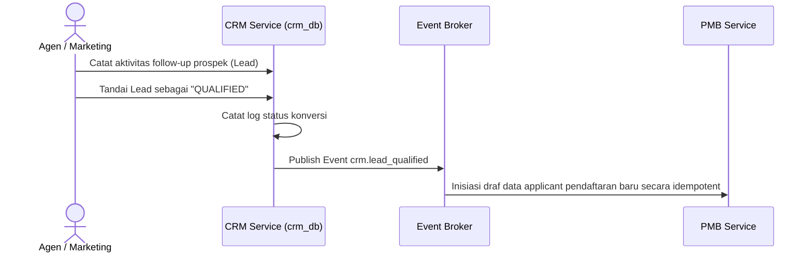

# Alur Proses Bisnis & Spesifikasi Fungsional - CRM Module

## 1. Visi & Tujuan Modul
Modul CRM mengoptimalkan pencatatan leads/calon pendaftar dari berbagai kanal pemasaran (sosial media, agen kemitraan, referral, event) dan memantau status tindak lanjut (*follow-up pipeline*) hingga dikonversi menjadi pendaftar PMB.

## 2. Tabel Spesifikasi Fungsional (FSD)

| Layar / Fungsi | Peran (Role) | Field Utama | Aksi Pengguna | Validasi / Aturan Bisnis | Output / Integrasi |
| --- | --- | --- | --- | --- | --- |
| **Campaign Management** | Admin CRM | Campaign Code, Name, Channel, Period, Budget | Create, Update, Close | Tanggal mulai harus sebelum tanggal berakhir, Kode unik | Pilihan campaign pada form leads |
| **Lead Capture** | Marketing, Agent | Nama, Email, Telepon, Prodi Minat, Source | Create Lead | Validasi format email & telepon, pengecekan duplikasi otomatis | Prospek baru terekam di crm_db |
| **Lead Pipeline** | Marketing | Lead ID, Status, Owner, Next Activity | Move Status, Assign Owner | Status transisi harus mengikuti aturan state machine | Update tahapan prospek |
| **Follow-up Activity** | Marketing, Agent | Lead ID, Tipe Aktivitas, Catatan, Tanggal | Add Activity Log | Catatan tidak boleh kosong, Lead harus aktif | Histori interaksi prospek |
| **Agent / Referral** | Admin CRM | Data Agen, Referral Code, Skema Komisi | Create, Update, Deactivate | Kode referral harus unik | Kode referral aktif untuk pendaftaran |
| **Convert to Applicant** | Admin CRM | Lead ID, Gelombang PMB, Prodi Target | Convert to PMB | Lead harus berstatus "Qualified", pencegahan duplikasi pendaftar | Pendaftar PMB terbentuk di pmb_db |
| **Komisi Rujukan** | Admin CRM | Agent ID, Applicant ID, Skema Komisi, Nilai | Calculate, Approve | Pendaftar harus sudah melakukan pembayaran registrasi PMB | Data pencairan komisi siap bayar |

---

## 3. Diagram Alur Proses Bisnis

### A. Alur Kualifikasi Prospek & Konversi

### B. Alur Perhitungan Komisi Agen
1. **Pemicu Kelulusan**: PMB mengabarkan via event bahwa pendaftar yang dirujuk oleh kode referral agen telah melunasi biaya pendaftaran/daftar ulang.
2. **Kalkulasi Komisi**: CRM menangkap event tersebut dan secara otomatis memicu perhitungan besaran komisi berdasarkan skema aturan komisi aktif.
3. **Pencairan Keuangan**: Komisi disetujui oleh Admin CRM dan dikirimkan ke modul Finance untuk masuk ke antrean pencairan dana (*disbursement*).

---

## 4. Keandalan Lintas Modul (Failure Isolation & Recovery)
* **Outbox Pending Retry**: Jika modul PMB down saat proses konversi leads dilakukan, data leads konversi akan ditahan di tabel outbox CRM dan worker akan melakukan pengiriman ulang secara otomatis sampai PMB pulih kembali.
* **Idempotency Handover**: Pengiriman conversion request membawa ID lead sebagai kunci idempotensi untuk mencegah pembentukan draf applicant PMB ganda akibat pengiriman ulang kuis/koneksi.
