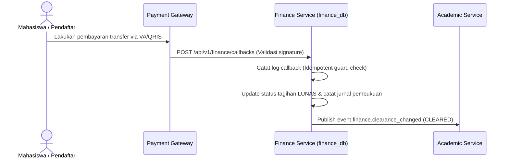

# Alur Proses Bisnis & Spesifikasi Fungsional - Finance Module

## 1. Visi & Tujuan Modul
Modul Finance menjamin transparansi dan keakuratan pengelolaan keuangan kampus, mencakup pembuatan invoice tagihan, penerimaan pembayaran dari payment gateway luar, rekonsiliasi kas bank, jurnal akuntansi pembukuan berpasangan, hingga evaluasi status pembebasan akademik mahasiswa.

## 2. Tabel Spesifikasi Fungsional (FSD)

| Layar / Fungsi | Peran (Role) | Field Utama | Aksi Pengguna | Validasi / Aturan Bisnis | Output / Integrasi |
| --- | --- | --- | --- | --- | --- |
| **Kelola Invoice** | Admin Finance | Payer ID, Tipe Target, Nominal, Batas Bayar | Create, Issue Invoice | Payer harus valid, nominal harus di atas nol | Invoice terbit, jurnal piutang tercatat |
| **Antrean Tagihan** | Admin Finance | Source Modul, NIM/No Reg, Komponen Biaya | Approve Request, Reject | Validasi draf request dari PMB/Akademik | Tagihan invoice resmi diterbitkan |
| **PG Callback Log** | System, Admin Finance | Callback ID, Invoice ID, Signature, Nominal | Receive, Validate | Validasi keaslian signature, cek double payment | Pembayaran lunas, jurnal kas tercatat |
| **Verifikasi Manual** | Admin Finance | Bukti Bayar, Nama Bank, Tanggal Transfer | Approve, Reject | Bukti transfer harus jelas, alasan penolakan wajib jika reject | Pembayaran disahkan |
| **Kuitansi Resmi** | Admin Finance, Payer | Payment ID, No Kuitansi, Tanggal Bayar | Generate, Download | Hanya untuk pembayaran berstatus sukses | File kuitansi PDF resmi dikeluarkan |
| **Clearance Policy** | Admin Finance | Lingkup Layanan, Batas Toleransi Tunggakan | Create, Update | Aturan tidak boleh tumpang tindih | Skema filter kelayakan layanan akademik |
| **Evaluasi Clearance** | Admin Finance, Akademik | NIM Mahasiswa, Status Keuangan, Status Clearance | Evaluate, Override | Override dispensasi membutuhkan alasan tertulis | Status clear/blocked/conditional |
| **Dispensasi Cicilan** | Admin Finance | Invoice ID, Jadwal Cicilan, Nominal Cicilan | Create, Approve | Pembagian termin cicilan dan tanggal jatuh tempo valid | Sesi clearance diubah ke conditional |

---

## 3. Diagram Alur Proses Bisnis

### A. Alur Pembayaran & Rekonsiliasi Otomatis (Payment Gateway Callback)

### B. Alur Pengajuan Dispensasi Pembayaran (Dispensasi Clearance)
1. **Ajukan Permohonan**: Mahasiswa mengajukan permohonan cicilan UKT semester berjalan karena kendala finansial.
2. **Review & Persetujuan**: Admin Keuangan meninjau permohonan, menyusun pembagian termin cicilan, dan menerbitkan persetujuan.
3. **Pemberian Kelonggaran**: Status clearance mahasiswa diubah dari `BLOCKED` menjadi `CONDITIONAL`. Modul Akademik menangkap perubahan ini untuk mengizinkan mahasiswa mengisi KRS dan mengikuti UTS/UAS.

---

## 4. Keandalan Lintas Modul (Failure Isolation & Recovery)
* **Idempotency Callback Guard**: Callback token dikunci menggunakan *unique constraint composite* (`provider`, `provider_event_id`) untuk menolak pemrosesan ganda akibat transmisi ulang data dari payment gateway.
* **Fallback Clearance Database**: Seluruh modul operasional kampus yang bergantung pada modul Finance (KRS SIAKAD, Kelas LMS, dsb.) akan mengandalkan snapshot clearance lokal terakhir jika terjadi kegagalan jaringan ke database Finance.
