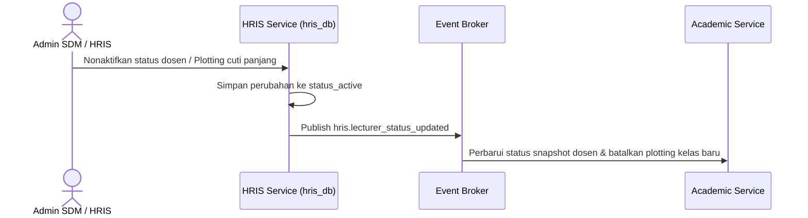

# Alur Proses Bisnis & Spesifikasi Fungsional - HRIS Module

## 1. Visi & Tujuan Modul
Modul HRIS bertindak sebagai authority untuk mengelola database karyawan, dosen pembimbing akademik/pengampu, struktur jabatan organisasi unit, pencatatan absensi, pengajuan cuti, perhitungan BKD (Beban Kerja Dosen), dan parameter gaji pokok.

## 2. Tabel Spesifikasi Fungsional (FSD)

| Layar / Fungsi | Peran (Role) | Field Utama | Aksi Pengguna | Validasi / Aturan Bisnis | Output / Integrasi |
| --- | --- | --- | --- | --- | --- |
| **Master Pegawai** | Admin SDM | Nama Personal, NIP, Unit Kerja, Jabatan, Status | Create, Update, Deactivate | Relasi person Core valid, NIP harus unik | Profil pegawai aktif |
| **Profil Dosen** | Admin SDM | NIDN/NIDK, Homebase Prodi, Pangkat, Status Aktif | Create, Update | Format NIDN valid (10 digit), NIDN unik | Data induk dosen aktif |
| **Penugasan Jabatan** | Admin SDM | Pegawai ID, Jabatan, Tanggal Mulai Efektif | Assign Position | Tanggal mulai valid, riwayat jabatan disimpan | Riwayat karir kepegawaian |
| **Status Aktif** | Admin SDM | Status (Cuti/Aktif/Pensiun), Alasan Perubahan | Change Status | Alasan wajib diisi jika berstatus nonaktif | Status dosen di modul luar |
| **Pencatatan Absensi** | Pegawai | Nama Pegawai, Tanggal, Jam Masuk, Jam Keluar | Check-in, Check-out | Lokasi GPS valid/IP terdaftar | Riwayat absensi kerja harian |
| **Permohonan Cuti** | Pegawai | Tipe Cuti, Tanggal Mulai, Tanggal Selesai | Submit Cuti, Approve | Kuota cuti mencukupi, disetujui atasan | Pemotongan kuota cuti |
| **Penilaian BKD** | Admin SDM | Dosen ID, Periode, Beban Mengajar/Penelitian | Create, Update BKD | Periode akademik aktif | Nilai kelayakan kerja dosen |

---

## 3. Diagram Alur Proses Bisnis

### A. Alur Sinkronisasi Data Keaktifan Dosen

### B. Alur Pengajuan Cuti Staf/Dosen
1. **Input Pengajuan**: Pegawai mengajukan cuti melalui portal HRIS dengan melampirkan tanggal rencana cuti dan alasan.
2. **Validasi Kuota**: Sistem secara otomatis mengecek kuota cuti tahunan pegawai yang tersisa.
3. **Approval Alur**: Atasan menyetujui permohonan. HRIS menerbitkan status ketidakhadiran yang otomatis terintegrasi dengan data log mesin absen harian.

---

## 4. Keandalan Lintas Modul (Failure Isolation & Recovery)
* **Local Lecturer Snapshot**: Modul Akademik dan LMS tidak memanggil database HRIS secara langsung untuk plotting jadwal kelas kuliah. Modul tersebut menggunakan tabel `lecturer_snapshots` lokal agar operasional perkuliahan tidak terhenti saat HRIS mengalami gangguan.
* **Status Changed Event**: Perubahan keaktifan dosen diterbitkan sebagai event sehingga Akademik langsung memblokir dosen tersebut dari plotting jadwal baru secara eventual konsisten.
