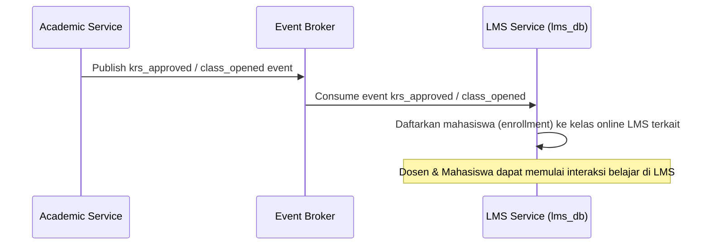

# Alur Proses Bisnis & Spesifikasi Fungsional - LMS Module

## 1. Visi & Tujuan Modul
Modul LMS memfasilitasi kegiatan belajar mengajar online secara interaktif, menyediakan ruang materi ajar, pengunggahan tugas mingguan, kuis mandiri, forum diskusi dosen-mahasiswa, serta tracking keaktifan belajar online.

## 2. Tabel Spesifikasi Fungsional (FSD)

| Layar / Fungsi | Peran (Role) | Field Utama | Aksi Pengguna | Validasi / Aturan Bisnis | Output / Integrasi |
| --- | --- | --- | --- | --- | --- |
| **Penerima Sinkronisasi Kelas** | System | Kelas Akademik ID, Mata Kuliah, Dosen | Receive Sync | Kode kelas akademik harus unik, dosen terdaftar | Pembukaan kelas LMS otomatis |
| **Sinkronisasi Peserta** | System | Mahasiswa ID, Kelas ID, Status KRS | Receive Sync | Hanya untuk mahasiswa dengan KRS disetujui | Hak akses belajar (enrollment) |
| **Dashboard Kelas** | Dosen, Mhs | Informasi Kelas, Sesi Pertemuan, Tugas | View Dashboard | Sesuai pembagian kelas / self scope | Beranda belajar online |
| **Kelola Sesi** | Dosen | Nomor Sesi (1-16), Judul Sesi, Deskripsi | Create, Update Session | Dosen pengampu kelas bersangkutan | Sesi pertemuan mingguan |
| **Kelola Materi** | Dosen | Judul Materi, File Upload, Tipe Dokumen | Upload, Publish | Ukuran berkas dibatasi, tipe file diperbolehkan | Dokumen ajar terpublikasi |
| **Tugas Kuliah (Assignment)** | Dosen, Mhs | Judul Tugas, Instruksi, Batas Waktu, Lembar Kumpul | Create Tugas, Submit, Koreksi Nilai | Batas waktu valid, file kumpul di bawah batas | Lembar jawaban & nilai tugas |
| **Diskusi Kelas** | Dosen, Mhs | Topik Diskusi, Komentar, Balasan | Post Topic, Reply | Peserta kelas terdaftar aktif | Forum interaksi tanya-jawab |
| **Link Vicon** | Dosen | Provider Zoom/Meet, URL Link, Jam Mulai | Create, Update Link | Format link valid | Akses kuliah tatap maya |
| **Absensi LMS** | Dosen | Sesi Pertemuan, Mahasiswa, Kehadiran | Mark Attendance | Mahasiswa harus aktif terdaftar | Presensi belajar online |
| **Grade Sync** | System | Nilai Aktivitas, Mahasiswa ID, Komponen | Send to Academic | Idempotent, tidak menimpa nilai final SIAKAD | Sinkronisasi draf nilai ke SIAKAD |

---

## 3. Diagram Alur Proses Bisnis

### A. Alur Sinkronisasi Kelas & Peserta LMS (Auto Provisioning)

### B. Alur Pengumpulan Tugas & Penyerahan Nilai LMS
1. **Submit Tugas**: Mahasiswa mengunggah file lembar jawaban tugas kuliah sebelum batas waktu pengumpulan.
2. **Koreksi Nilai**: Dosen memeriksa berkas jawaban mahasiswa dan menginput nilai angka di LMS.
3. **Penyelarasan Nilai**: Sistem LMS mencatatkan nilai tugas tersebut dan secara asinkron mempublikasikan event `lms.grade_input_submitted` untuk menyalurkan draf nilai tugas tersebut ke modul SIAKAD.

---

## 4. Keandalan Lintas Modul (Failure Isolation & Recovery)
* **Standalone LMS Operation**: Jika database SIAKAD mengalami gangguan, ruang kelas LMS yang sudah tersinkronisasi sebelumnya harus tetap dapat berjalan normal. Dosen tetap dapat mengunggah materi dan mahasiswa dapat mengunduh berkas.
* **Outbox Grade Sync**: Pengiriman data nilai ke SIAKAD ditahan dalam outbox antrean jika SIAKAD down, dan secara otomatis dikirim ulang saat SIAKAD online.
