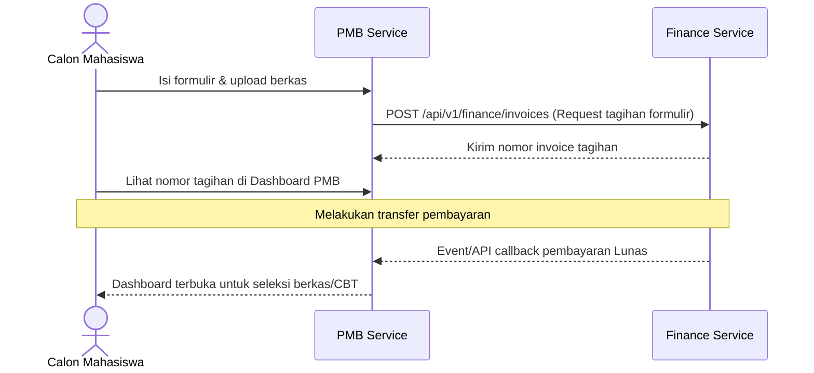

# Alur Proses Bisnis & Spesifikasi Fungsional - PMB Module

## 1. Visi & Tujuan Modul
Modul Penerimaan Mahasiswa Baru (PMB) melayani proses seleksi penerimaan mahasiswa secara transparan dan teratur, mulai dari pengisian biodata diri, pemenuhan berkas administrasi, ujian CBT masuk, hingga handover data mahasiswa baru ke modul SIAKAD.

## 2. Tabel Spesifikasi Fungsional (FSD)

| Layar / Fungsi | Peran (Role) | Field Utama | Aksi Pengguna | Validasi / Aturan Bisnis | Output / Integrasi |
| --- | --- | --- | --- | --- | --- |
| **Registrasi Publik** | Pendaftar | Jalur Masuk, Prodi Pilihan, Gelombang, Biodata Awal | Register | Gelombang pendaftaran harus berstatus aktif/terbuka | Akun pendaftar (submitted) |
| **Dashboard Calon** | Pendaftar | Status Berkas, Ujian, Invoice, LoA, Handover | View Status, Lanjutkan | Self scope data restriction | Panduan tahapan PMB |
| **Pengisian Biodata** | Pendaftar | Data Pribadi, NIK, Alamat, Asal Sekolah, Keluarga | Save Draft, Submit | Format NIK & telepon valid, field wajib terisi lengkap | Data biodata lengkap |
| **Upload Dokumen** | Pendaftar | Jenis Dokumen, File Upload, Catatan | Upload, Ganti Berkas | Tipe file diperbolehkan (PDF/JPG), batas ukuran file | Dokumen berstatus pending verifikasi |
| **Verifikasi Berkas** | Admin PMB | Dokumen ID, Status, Catatan Verifikator | Approve, Reject | Catatan penolakan wajib diisi jika berstatus reject | Dokumen verified/rejected |
| **Ujian Masuk CBT** | Admin PMB | Pendaftar ID, Sesi Ujian, Konteks Ujian | Assign CBT Session | Pendaftar harus berstatus lolos verifikasi berkas | Peserta terdaftar CBT Ujian |
| **Request Tagihan** | Admin PMB | Pendaftar ID, Komponen Tagihan, Batas Bayar | Issue Tagihan | Komponen biaya valid sesuai jalur masuk pendaftar | Request invoice ke Finance |
| **Daftar Ulang** | Camaba, Admin PMB | Pendaftar Lolos, Dokumen Daftar Ulang | Submit Daftar Ulang, Validasi | Pendaftar berstatus lulus seleksi & invoice lunas | Daftar ulang valid |
| **Penerbitan LoA** | Admin PMB | Pendaftar ID, Nomor LoA, Template | Issue LoA, Download LoA | Pembayaran lunas, biodata lengkap, kelayakan daftar ulang | LoA dikeluarkan |
| **Handover ke SIAKAD** | Admin PMB | Pendaftar Lulus, Prodi Target, Kurikulum | Trigger Handover | Status ready_for_academic, data bersih dari error | Event pmb.ready_for_academic |

---

## 3. Diagram Alur Proses Bisnis

### A. Alur Pendaftaran Calon Mahasiswa Baru

### B. Alur Handover Mahasiswa Baru ke SIAKAD
1. **Daftar Ulang**: Calon mahasiswa lolos seleksi melengkapi dokumen daftar ulang dan melunasi tagihan registrasi awal.
2. **LoA Rilis**: Sistem PMB mengeluarkan *Letter of Acceptance* (LoA).
3. **Handover**: Admin PMB mengeklik serah terima data ke SIAKAD. Sistem PMB mengirimkan event `pmb.ready_for_academic` ke modul Akademik untuk penomoran NIM otomatis secara idempotent.

---

## 4. Keandalan Lintas Modul (Failure Isolation & Recovery)
* **Degraded Billing Display**: Jika database Finance down, calon mahasiswa tetap dapat mengisi data biodata dan mengunggah berkas. Status pembayaran pada dashboard akan memuat label status terakhir yang tersimpan dengan peringatan data belum ter-update.
* **Idempotency Handover Guard**: Event handover membawa ID pendaftar unik yang dikunci di database Akademik untuk menghindari NIM ganda jika pesan event terkirim ulang.
