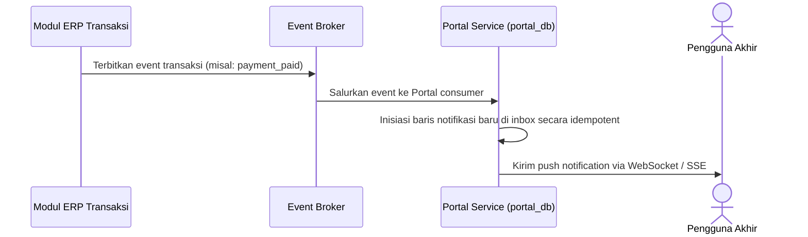

# Alur Proses Bisnis & Spesifikasi Fungsional - Portal Module

## 1. Visi & Tujuan Modul
Modul Portal menyajikan gerbang utama interaksi pengguna, mengumpulkan notifikasi aktivitas bisnis penting, menyimpan preferensi tampilan dashboard, serta menyajikan grafik metrik operasional terpadu (*KPI dashboard*) bagi jajaran pimpinan kampus.

## 2. Tabel Spesifikasi Fungsional (FSD)

| Layar / Fungsi | Peran (Role) | Field Utama | Aksi Pengguna | Validasi / Aturan Bisnis | Output / Integrasi |
| --- | --- | --- | --- | --- | --- |
| **Dashboard Peran** | Semua Pengguna | Peran Aktif, Daftar Widget, Pintasan | View Dashboard | Tampilan widget dibatasi hak akses peran aktif | Beranda portal personal |
| **Notification Center** | Semua Pengguna | Judul Notifikasi, Modul Sumber, Status Baca | View, Mark Read | Hanya untuk pengguna terdaftar | Status terbaca notifikasi |
| **Shortcut** | Semua Pengguna | Menu Code, Label Menu, Urutan Sortir | Add, Remove, Reorder | Menu harus diizinkan sesuai perizinan peran | Kumpulan menu akses cepat |
| **User Preference** | Semua Pengguna | Bahasa, Tema Visual, Notifikasi | Update Preference | Self scope data restriction | Pengaturan user tersimpan |
| **Portal Pendaftar** | Pendaftar | Jalur PMB, Status Berkas, Tagihan UKT | View, Lanjutkan | Self scope data restriction | Halaman status seleksi PMB |
| **Portal Mahasiswa** | Mahasiswa | Riwayat KRS, Pembayaran UKT, Kelas LMS | View, Download | Sesuai aturan clearance keuangan terakhir | Halaman SIAKAD/LMS mahasiswa |
| **Portal Dosen Wali** | Dosen Wali (PA) | Kelas Wali, KRS Mahasiswa Wali | View, Approval KRS | Scope mahasiswa wali dibatasi PA | Persetujuan draf KRS |
| **Dashboard Pimpinan** | Pimpinan | Funnel PMB, Pendapatan UKT, Statistik LMS | View KPI | Read-only aggregate dashboard | Metrik evaluasi pimpinan |
| **Log Aktivitas** | User, Admin | Tipe Aktivitas, Timestamp, Deskripsi | View Log | Scope disesuaikan perizinan admin | Jejak riwayat login/akses |

---

## 3. Diagram Alur Proses Bisnis

### A. Alur Pendistribusian Notifikasi

### B. Alur Visualisasi Executive Dashboard
1. **Penyusunan Proyeksi**: Seluruh event mutasi bisnis dari PMB, Akademik, dan Finance ditangkap dan diproyeksikan asinkron ke tabel read model `dashboard_read_models`.
2. **Dashboard Render**: Saat pimpinan memuat modul Portal, dashboard menyajikan metrik KPI (seperti jumlah pendaftar gelombang ini, total pembayaran UKT semester ini) langsung dari read model tanpa melakukan SQL join langsung ke database transaksional.
3. **Data Freshness Indicator**: Widget visual menampilkan indikator waktu pembaruan terakhir (*refreshed_at*) secara jelas.

---

## 4. Keandalan Lintas Modul (Failure Isolation & Recovery)
* **Degraded Dashboard Widgets**: Jika salah satu microservice down, dashboard Portal tetap dapat dibuka dan menyajikan widgets data dari modul lain yang aktif. Widget untuk modul yang down akan menampilkan status offline beserta data snapshot terakhir yang terekam.
* **Idempotency Inbox Consumer**: Inbox notifikasi mencatat kunci event unik (`event_key`) untuk mencegah duplikasi pemuatan pesan notifikasi yang sama kepada pengguna.
