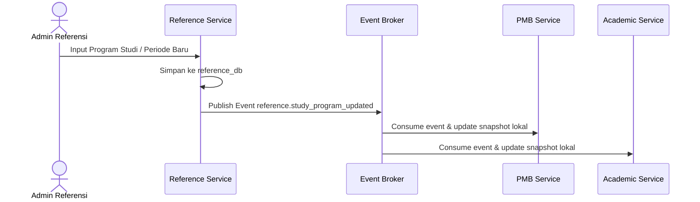

# Alur Proses Bisnis & Spesifikasi Fungsional - Referensi Module

## 1. Visi & Tujuan Modul
Modul Referensi bertanggung jawab mengelola master data umum yang digunakan secara kolektif oleh modul-modul lain di dalam ekosistem UNSIA ERP, seperti data program studi, tahun akademik, periode semester, wilayah geografis, agama, komponen biaya, dan kode status.

## 2. Tabel Spesifikasi Fungsional (FSD)

| Layar / Fungsi | Peran (Role) | Field Utama | Aksi Pengguna | Validasi / Aturan Bisnis | Output / Integrasi |
| --- | --- | --- | --- | --- | --- |
| **Katalog Master Data** | Admin Referensi | Code, Name, Category, Status | Create, Update, Deactivate | Kode unik, relasi tidak boleh diputus jika data referensi terpakai | Sinkronisasi master dropdown ke semua modul |
| **Program Studi** | Admin Referensi | Prodi Code, Nama Prodi, Jenjang, Fakultas, Status | Create, Update, Deactivate | Kode harus unik, dilarang hapus fisik jika sudah ada mahasiswa | Prodi aktif tersedia untuk PMB & SIAKAD |
| **Tahun Ajaran** | Admin Akademik | Code (2026/2027), Start Date, End Date, Status | Create, Activate, Close | Rentang tanggal valid, hanya satu Tahun Ajaran aktif operasional | Kalender dasar akademik |
| **Periode Akademik** | Admin Akademik | Tahun Ajaran ID, Tipe Semester (Ganjil/Genap), Tanggal Kuliah, Status | Create, Update, Activate | Periode tanggal wajib masuk lingkup Tahun Ajaran induknya | Periode KRS, kuis, dan tagihan keuangan |
| **Status Code** | Admin Referensi | Domain, Code, Label, Sort Order, Active | Create, Update, Deactivate | Kombinasi domain dan code bersifat unik | Status transaksi konsisten (bukan string bebas) |
| **Komponen Biaya** | Admin Finance | Component Code, Name, Type, Base Amount | Create, Update, Deactivate | Dilarang hapus komponen biaya jika sudah terbit invoice | Komponen invoice UKT/pendaftaran |

---

## 3. Diagram Alur Proses Bisnis

### A. Alur Sinkronisasi Master Data

### B. Alur Pembukaan Periode Akademik Baru
1. **Buat Tahun Ajaran**: Admin Akademik Biro menginisialisasi Tahun Ajaran aktif (misal: `2026/2027`).
2. **Definisi Semester**: Admin membuka draf periode akademik di bawah tahun ajaran tersebut (misal: `2026/2027-GANJIL`) beserta tanggal kelas dan batas persentase kehadiran minimum.
3. **Penyebaran Event**: Setelah periode diaktifkan, event diterbitkan ke modul Keuangan, PMB, SIAKAD, dan LMS agar periode tersebut siap dipilih pada transaksi baru.

---

## 4. Keandalan Lintas Modul (Failure Isolation & Recovery)
* **Local Snapshot Cache**: Jika modul Referensi mengalami gangguan, modul transaksi (PMB, Akademik, Finance) tetap dapat melakukan lookup data menggunakan *local reference snapshots* terakhir yang tersimpan di database lokal masing-masing modul.
* **Effective Dating**: Perubahan master referensi tidak menimpa riwayat data historis pada transaksi lama (menggunakan penanggalan berlaku efektif).
