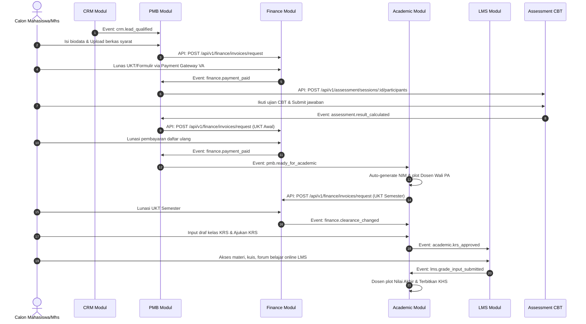

# Alur Proses Bisnis & Integrasi Teknis Global - UNSIA ERP (Developer Edition)

## 1. Peta Integrasi Endpoint Lintas Layanan (API Integration Map)
Berikut adalah daftar endpoint krusial antar-microservice yang dilewati selama siklus hidup mahasiswa dari awal pendaftaran hingga yudisium:

| Modul Asal | Modul Tujuan | HTTP Method & Route Path | Trigger Bisnis | Parameter Utama / Request Body |
| --- | --- | --- | --- | --- |
| **Portal / Gateway** | **Core** | `POST /api/v1/auth/login` | Otentikasi Pengguna SSO | `{ "username", "password" }` |
| **CRM** | **PMB** | `POST /api/v1/pmb/applicants/convert` | Konversi lead qualified menjadi pendaftar | `{ "lead_id", "person_ref_id", "target_period_id", "study_program_id" }` |
| **PMB** | **Finance** | `POST /api/v1/finance/invoices/request` | Pembuatan tagihan formulir pendaftaran | `{ "payer_type": "applicant", "payer_id", "component_code": "PMB_REG", "amount" }` |
| **Payment Gateway** | **Finance** | `POST /api/v1/finance/callbacks` | Webhook konfirmasi pembayaran lunas | VA number, Signature, Transaction Status |
| **PMB** | **Assessment** | `POST /api/v1/assessment/sessions/:session_id/participants` | Daftarkan calon mahasiswa ke CBT seleksi | `{ "applicant_id", "person_id", "participant_type": "applicant" }` |
| **Assessment** | **PMB** | `POST /api/v1/pmb/applicants/:id/scores` | Sync hasil nilai seleksi CBT masuk | `{ "score": 85.50, "status": "PASSED" }` |
| **PMB** | **Academic** | `POST /api/v1/academic/students/handover` | Serah terima data calon mahasiswa lulus | `{ "applicant_id", "person_id", "study_program_id", "target_period_id" }` |
| **Academic** | **LMS** | `POST /api/v1/lms/classes/sync` | Provisioning kelas online semester baru | `{ "academic_class_id", "course_code", "lecturer_id" }` |
| **LMS** | **Academic** | `POST /api/v1/academic/grades/submit-draft` | Sinkronisasi draf nilai tugas perkuliahan | `{ "student_id", "class_id", "task_score" }` |

---

## 2. Alur Detak Pesan (Event Flow)
Alur di bawah memetakan siklus transaksi modular lengkap beserta nama event yang diterbitkan ke broker pesan.

---

## 3. Aturan Transisi Status Utama (State Machine)
Developer wajib memvalidasi transisi status bisnis sebelum melakukan update data ke database lokal:

### A. Pendaftaran PMB (Applicant Status)
* **DRAFT** $\rightarrow$ **SUBMITTED** (saat calon mengunci form biodata).
* **SUBMITTED** $\rightarrow$ **VERIFIED** / **REJECTED** (proses seleksi berkas oleh Admin PMB).
* **VERIFIED** $\rightarrow$ **CBT_SCHEDULED** (sesaat setelah dipetakan sesi ujian di CBT).
* **CBT_SCHEDULED** $\rightarrow$ **PASSED** / **FAILED** (kalkulasi otomatis dari engine Assessment).
* **PASSED** $\rightarrow$ **RE_REGISTERED** (ketika registrasi awal dinyatakan lunas di Finance).

### B. Pengajuan KRS Semester (KRS Status)
* **DRAFT** $\rightarrow$ **SUBMITTED** (diajukan oleh mahasiswa setelah validasi kuota SKS & clearance).
* **SUBMITTED** $\rightarrow$ **APPROVED** / **REJECTED** (diputuskan oleh Dosen PA Pembimbing).
* **APPROVED** $\rightarrow$ **CLOSED** (saat masa pengisian KRS semester resmi berakhir).
